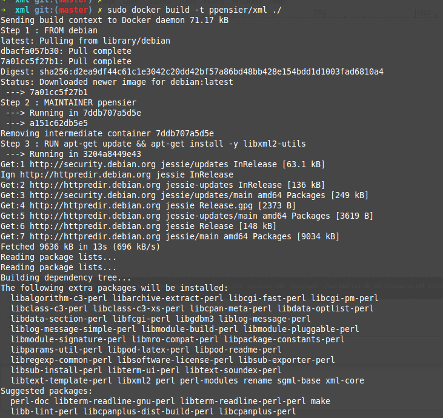
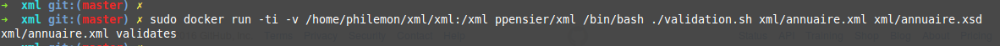

# Application permettant de valider un XML et son XSD sur une machine supportant Docker

----------------------------------------------------------------------

L'application proposée permet de valider un fichier XSD ainsi que son fichier XML sur un conteneur Docker. 

## Construction de l'image

L'image Docker proposée fonctionnne à partir d'une image basée sur ubuntu et utilise un outils de validation xml issu de la librairie libxml2-utils: xmllint. Pour cela, la construction de la nouvelle image est basée sur un dockerfile.

Commande correspondant à la construction de l'image:

    sudo docker build -t ppensier/xml ./
    

## Exécution du conteneur

Commande d'exécution du container:

    sudo docker run -ti -v /home/philemon/xml/xml:/xml ppensier/xml /bin/bash ./validation.sh xml/annuaire.xml xml/annuaire.xsd

(Voir les captures d'écran correspondantes dans le dossier images)

